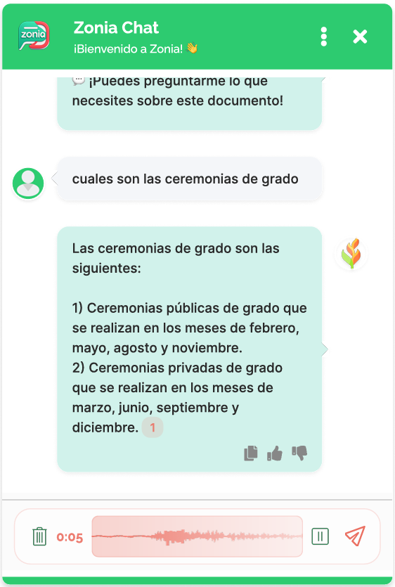
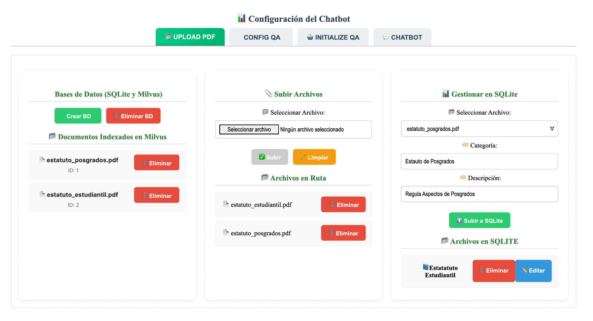
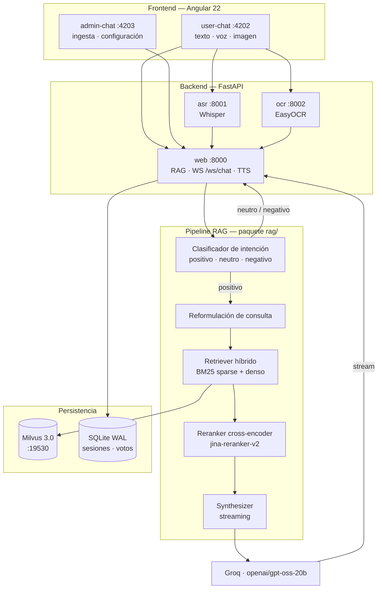

<div align="center">

# ZONIA

**Asistente conversacional RAG sobre normativa institucional — consultable por texto, voz o foto.**

[](https://www.python.org/)
[](https://fastapi.tiangolo.com/)
[](https://angular.dev/)
[](https://milvus.io/)
[](https://pytorch.org/)
[](https://www.docker.com/)
[](LICENSE)

**[Demostraciones](#demostraciones)** · **[Cómo funciona](#cómo-funciona)** ·
**[El desafío del corpus](#el-desafío-del-corpus)** ·
**[Decisiones de ingeniería](#decisiones-de-ingeniería)** ·
**[Puesta en marcha](#puesta-en-marcha)**

</div>

---

## Qué es

ZONIA es un prototipo de **Retrieval-Augmented Generation (RAG)** que responde preguntas sobre un
corpus normativo —el estatuto estudiantil de pregrado y posgrado de una universidad pública
colombiana— con **trazabilidad de fuentes**: cada respuesta cita los fragmentos del PDF que la
sustentan y el usuario puede abrirlos en el visor integrado.

El objetivo del proyecto fue de **accesibilidad**: la misma pregunta se puede hacer escribiendo,
hablando (ASR) o mandando una foto del documento (OCR), y la respuesta se devuelve en texto y en
audio (TTS). Eso convierte un PDF de decenas de páginas en algo consultable por alguien con baja
visión, con dificultad de lectura, o simplemente con prisa.

El motor RAG **no usa un framework de terceros como dependencia**: es un fork de LlamaIndex
vendorizado e intervenido (161 módulos, ~27 000 líneas de Python), con retriever híbrido propio
sobre Milvus, un splitter que entiende la jerarquía de un documento legal y una capa de
clasificación de intención que corta la consulta antes de gastar tokens.

Nada de eso es decoración: el corpus son **dos estatutos con estructura casi idéntica** —99 números
de artículo aparecen en los dos— y un RAG de manual falla ahí de forma sistemática. Ver
[El desafío del corpus](#el-desafío-del-corpus).

> **Estado del proyecto.** Prototipo de trabajo de grado: funcional y evaluado con usuarios, pero
> no endurecido para producción. No tiene memoria conversacional y su filtro de intención rechaza
> más de la cuenta — las dos cosas están explicadas, con su causa, en
> [Limitaciones conocidas](#limitaciones-conocidas). Se construyó y se midió en un portátil con
> 4 GB de VRAM, lo que condicionó buena parte del diseño: ver
> [Entorno de desarrollo](#entorno-de-desarrollo).

---

<details>
<summary><b>Índice completo</b></summary>

**El proyecto**
1. [Qué es](#qué-es)
2. [Demostraciones](#demostraciones) — videos, capturas y documentación
3. [Cómo funciona](#cómo-funciona) — arquitectura y ruta de una consulta
4. [Stack](#stack)

**El problema y las decisiones**

5. [El desafío del corpus](#el-desafío-del-corpus) — por qué un RAG de manual falla aquí
6. [Aislamiento por documento](#aislamiento-por-documento-la-solución-a-la-ambigüedad)
7. [Decisiones de ingeniería](#decisiones-de-ingeniería) — 9 problemas y sus soluciones
8. [Evaluación](#evaluación) — resultados con 31 evaluadores

**Operación**

9. [Requisitos](#requisitos)
10. [Puesta en marcha](#puesta-en-marcha)
11. [Configuración del pipeline](#configuración-del-pipeline)

**Referencia técnica**

12. [API](#api)
13. [Protocolo del WebSocket](#protocolo-del-websocket)
14. [Modelo de datos](#modelo-de-datos)
15. [Frontend](#frontend)
16. [Estructura del repositorio](#estructura-del-repositorio)

**Contexto**

17. [Evolución del stack](#evolución-del-stack) — de OpenAI a Groq, y por qué
18. [Entorno de desarrollo](#entorno-de-desarrollo) — el hardware y su efecto en el diseño
19. [Limitaciones conocidas](#limitaciones-conocidas) — qué no hace y por qué
20. [Roadmap](#roadmap)
21. [Créditos](#créditos)
22. [Licencia](#licencia)

</details>

---

## Demostraciones

### 💬 Chat de usuario



[](https://youtu.be/v9PO7zl3h_U)

Widget embebible que se abre sobre la página institucional. En la captura, una
consulta real resuelta contra el estatuto:

- **Respuesta fundamentada.** El badge numerado al final del texto
  (`1`) es la **fuente citada**: al pulsarlo se abre el PDF original en el visor
  PDF.js, en el fragmento que sustenta la respuesta.
- **Entrada por voz.** La barra inferior muestra la grabación en curso con forma
  de onda y contador; el audio va a Whisper (`:8001`) y vuelve transcrito al
  campo de texto. También acepta foto, que pasa por EasyOCR (`:8002`).
- **Feedback por respuesta.** Copiar, 👍 y 👎 — el voto se persiste en SQLite
  ligado a la pregunta, la respuesta y el documento consultado.
- **Alcance explícito.** Antes de la primera pregunta, ZONIA ofrece los
  documentos agrupados por categoría y el usuario elige uno. El mensaje
  *"Puedes preguntarme lo que necesites sobre este documento"* confirma que la
  conversación ya tiene alcance: sin selección, el envío está bloqueado. Es la
  solución a la ambigüedad entre los dos estatutos — ver
  [Aislamiento por documento](#aislamiento-por-documento-la-solución-a-la-ambigüedad).

El texto llega en streaming token a token por WebSocket mientras Piper sintetiza
el audio en paralelo, por frontera de oración.

<br clear="all">

### 🎬 Consola de administración

[](https://youtu.be/x-39AW2PMEU)



Cuatro pestañas que corresponden una a una con los componentes de `admin-chat`:

| Pestaña | Qué permite |
|---|---|
| **UPLOAD PDF** | Subir documentos, registrarlos en SQLite con categoría y descripción, crear la colección vectorial y ver qué hay indexado en Milvus |
| **CONFIG QA** | Fragmentación y recuperación: `chunk_size`, `overlap`, tokenizer, modo de splitter, `top_k`, `sparse_top_k` |
| **INITIALIZE QA** | Modelos: proveedor y modelo de LLM, embeddings, reranker y `top_n` |
| **CHATBOT** | Consola de prueba del pipeline recién configurado |

La captura corresponde a **UPLOAD PDF**, donde se ve el flujo de ingesta completo
en sus tres etapas: gestión de las bases de datos y estado de lo indexado en
Milvus, carga del archivo a disco, y registro de metadatos en SQLite.

Dos detalles que conectan con el resto del README:

- Los documentos indexados son **`estatuto_posgrados.pdf` (ID 1)** y
  **`estatuto_estudiantil.pdf` (ID 2)**: exactamente los dos estatutos cuya
  estructura paralela obliga a la recuperación híbrida y al filtrado por
  `document_id`.
- Todo cambio guardado aquí dispara una **recarga en caliente debounceada** del
  pipeline; no hace falta reiniciar el backend.

### 📁 Documentación del proyecto

[](https://drive.google.com/drive/folders/1ax-tibhSy54ub5KIVhjgPq_BKFp4EiLe?usp=drive_link)

Carpeta con el material producido durante el desarrollo:

| Documento | Contenido |
|---|---|
| **Informe final** | Marco teórico, metodología, resultados y discusión completos |
| **Mockups de interfaz** | Diseño UI/UX previo a la implementación |
| **Diagramas de proceso** | Flujos del pipeline RAG, ASR, TTS, OCR y sesión de usuario |
| **Modelo relacional** | Esquema de la base de datos |
| **Manual de usuario** | Guía de uso del chat |
| **Manual de administrador** | Guía de ingesta y configuración |
| **Requisitos** | 38 requisitos funcionales y 13 no funcionales, con criterios medibles |
| **Instrumento de evaluación** | Encuesta de similitud aplicada a 31 evaluadores |

---

## Cómo funciona



### Ruta de una consulta

| # | Paso | Componente | Detalle |
|---|------|-----------|---------|
| 0 | **Selección de documento** | `GET /list_documents` → `POST /asociar_documento` | Acota la sesión a un `document_id`; sin él no se puede preguntar |
| 1 | Entrada | Angular → FastAPI | REST para gestión, WebSocket para el chat |
| 2 | Normalización | Whisper (voz) · EasyOCR (foto) | Servicios independientes, activables por feature flag |
| 3 | **Clasificación de intención** | LLM → JSON `{etiqueta, motivo}` | Saludo, despedida u off-topic **cortan aquí**: no se recupera ni se sintetiza |
| 4 | **Reformulación** | LLM + keywords del dominio | Reescribe la pregunta antes de buscar |
| 5 | Descomposición | `question_gen` | Máx. 3 subpreguntas para consultas compuestas |
| 6 | Vectorización | `jina-embeddings-v2-base-es` | 768 dims, fp16, CUDA |
| 7 | **Recuperación híbrida** | BM25 sparse (en Milvus) + denso | Fusión `or` / `and`, 10 + 10 candidatos |
| 8 | Re-ranking | `jina-reranker-v2-base-multilingual` | Cross-encoder, Top-N al prompt |
| 9 | Síntesis | Groq `openai/gpt-oss-20b` | `simple_summarize`, streaming token a token |
| 10 | Voz | Piper (`es-mx-laurav2`) | Buffer por frontera de oración, en paralelo al texto |
| 11 | Trazabilidad | Visor PDF.js sobre `/corpus_emb` | Fuentes abribles en el documento original |
| 12 | Feedback | FastAPI → SQLite | Voto ligado a pregunta, respuesta y documento |

---

## Stack

| Capa | Tecnología | Nota |
|---|---|---|
| Frontend | **Angular 22** (workspace multi-proyecto), RxJS, Quill, RecordRTC | SSR con Express disponible |
| API | **FastAPI 0.141** + Uvicorn, WebSockets, orjson | 3 servicios independientes |
| Motor RAG | **`rag/`** — fork vendorizado de LlamaIndex | 161 módulos, autocontenido |
| Base vectorial | **Milvus 3.0** (+ etcd + MinIO), GUI Attu | `IVF_FLAT`, métrica COSINE |
| Base relacional | **SQLite** async (aiosqlite) en modo **WAL** | Sesiones, preguntas, respuestas, votos |
| Embeddings | `jinaai/jina-embeddings-v2-base-es` (local) | 768 dims, fp16, CUDA |
| Reranker | `jinaai/jina-reranker-v2-base-multilingual` (local) | Cross-encoder, 278M parámetros |
| LLM | **Groq** `openai/gpt-oss-20b` | Endpoint compatible con la API de OpenAI |
| ASR | `whisper-small-es` (local, ajustado a español) | Configurable vía `WHISPER_MODEL` |
| OCR | **EasyOCR** (`es`, `en`) | Timeout de 20 s → HTTP 408 |
| TTS | **Piper** (`es-mx-laurav2.onnx`) | Streaming por frontera de oración |
| NLP | spaCy `es_core_news_sm`, NLTK, tiktoken | Splitting y tokenización |
| Infraestructura | Docker Compose (6 servicios), Makefile | GPU opcional vía runtime NVIDIA |

### El motor RAG está vendorizado

`rag/` **no es una dependencia de PyPI**: es un fork de LlamaIndex copiado al repositorio e
intervenido en pipeline, retrievers, reranking, síntesis, vector stores, node parsers y memoria.
Se hizo así para poder modificar el pipeline sin esperar a upstream y para fijar el comportamiento
del prototipo. El coste es el esperado: las mejoras de LlamaIndex no llegan solas. La atribución
correspondiente está en [THIRD_PARTY_NOTICES.md](THIRD_PARTY_NOTICES.md).

Módulos propios más relevantes:

| Ruta | Qué aporta |
|---|---|
| `rag/pipeline/milvus_bm25_retriever.py` | Orquestador híbrido: caché LRU, intención, reformulación (637 líneas) |
| `rag/node_parser/relationship/legal_structure.py` | Splitter jerárquico para documentos normativos |
| `rag/vector_stores/milvus.py` | Vector store con búsqueda sparse y filtrado por documento |
| `rag/retrievers/hybrid_retriever.py` | Fusión de resultados denso + léxico |
| `rag/engine/subquestion_engine.py` | Descomposición en subpreguntas |
| `rag/memory/chat_summary_memory_buffer.py` | Memoria conversacional — **implementado pero no cableado**, ver [Limitaciones](#limitaciones-conocidas) |
| `rag/storage/chat_store/sqlite.py` | Persistencia del historial — **implementado pero no cableado** |

---

## El desafío del corpus

Este fue el problema difícil del proyecto, y el que justifica media arquitectura. Un estatuto
estudiantil no es un documento cualquiera: es un texto normativo con **estructura repetitiva y
vocabulario casi idéntico entre secciones que dicen cosas distintas**.

El corpus son dos documentos —estatuto de **pregrado** y estatuto de **posgrado**— con jerarquía
paralela. Midiendo sobre los PDFs reales:

| Colisión | Medición |
|---|---|
| **Números de artículo presentes en ambos documentos** | **99** (Art. 1 al 101) |
| Numeración de títulos y capítulos | Ambos reinician en `TÍTULO I` / `CAPÍTULO I` |
| Capítulos con nombre **idéntico** | `DEL RÉGIMEN DISCIPLINARIO` existe en los dos |
| Capítulos con equivalente temático | Matrícula, evaluación académica, derechos y deberes, programas académicos, clasificación de estudios |
| Parágrafos dependientes de su artículo | 186 (pregrado) + 77 (posgrado) |

Cada fila es una forma distinta de fallar:

1. **"¿Qué dice el artículo 45?"** es una pregunta ambigua: hay un artículo 45 en pregrado y otro
   en posgrado, con contenidos que no tienen nada que ver. Un embedding no distingue números; los
   trata como ruido de baja información. Sin señal léxica y sin metadatos de procedencia, el
   sistema devuelve el que quede más cerca en el espacio vectorial, que es una lotería.

2. **Los capítulos homónimos compiten entre sí.** Preguntar por el régimen disciplinario recupera
   fragmentos de los dos estatutos, redactados en un lenguaje jurídico casi calcado. El reranker
   ve dos candidatos casi indistinguibles y el LLM termina mezclando la sanción de posgrado con el
   procedimiento de pregrado en la misma respuesta.

3. **Un parágrafo suelto no significa nada.** *"Parágrafo 2. El plazo será de diez (10) días
   hábiles"* es literalmente inútil si se pierde el artículo que lo precede. Un splitter por
   tamaño fijo corta ahí con total naturalidad.

4. **La redundancia léxica rompe la intuición de BM25.** Términos como *estudiante*, *programa*,
   *semestre* o *Consejo Académico* aparecen en prácticamente todos los capítulos: no discriminan
   nada. Lo que sí discrimina —*"artículo 45"*, *"posgrado"*, siglas institucionales— es
   exactamente lo que un embedding denso diluye.

### Las respuestas del sistema

| Problema | Respuesta implementada |
|---|---|
| Números de artículo y siglas invisibles al embedding | **Retriever híbrido**: BM25 léxico junto a la búsqueda densa |
| Fragmentos huérfanos, sin capítulo ni artículo padre | **`LegalStructureParser`**: chunking por jerarquía normativa con metadatos |
| Candidatos casi idénticos entre los dos estatutos | **Indexación y consulta por documento** + reranker cross-encoder |

Las dos primeras son de recuperación y se detallan en
[Decisiones de ingeniería](#decisiones-de-ingeniería). La tercera es la que resuelve de raíz la
ambigüedad, y merece explicación aparte.

---

## Aislamiento por documento: la solución a la ambigüedad

Ninguna técnica de recuperación resuelve una pregunta que es **genuinamente ambigua**. Si hay un
artículo 45 en pregrado y otro en posgrado, *"¿qué dice el artículo 45?"* no tiene una respuesta
correcta: tiene dos. Afinar el reranker no arregla eso; solo cambia cuál de las dos se acierta por
azar.

La decisión fue no adivinar. **Cada documento se indexa por separado y la conversación se acota a
uno solo**, elegido por el usuario antes de la primera pregunta. Es una restricción del producto
que elimina la clase entera de error, en vez de mitigarla estadísticamente.

### Cómo se implementa, de punta a punta

**1. El administrador clasifica el documento al ingerirlo.** Al registrarlo en SQLite le asigna
**categoría** y **descripción** —en la captura de la consola: *"Estatuto de Posgrados"* /
*"Regula aspectos de posgrados"*—. La taxonomía no está en el código: la define quien administra el
corpus, y basta con subir un documento nuevo para que aparezca como opción.

**2. Cada documento se indexa con su propio identificador.** `index_documents(docs, document_id=…)`
sella los nodos con el `document_id`, y `is_document_indexed(id)` permite consultar el estado de
cada uno por separado. Milvus guarda una única colección, pero cada documento es direccionable
dentro de ella.

**3. El usuario elige antes de preguntar.** Al abrir el chat, ZONIA se presenta y llama a
`GET /list_documents`, que devuelve `id`, `nombre`, `categoria`, `descripcion` e
`indexado_en_milvus`. El frontend los **agrupa por categoría** (`listarAgrupados()`) y los presenta
como tarjetas seleccionables dentro de la propia conversación, no en un menú aparte:

```
📄 Estos son los documentos disponibles para consultar:
   └─ Estatuto de Posgrados      → estatuto_posgrados.pdf
   └─ Estatuto Estudiantil       → estatuto_estudiantil.pdf
```

**4. La elección fija el alcance de la sesión.** `seleccionarDocumentoCompleto()` muestra la
descripción del documento y llama a `POST /asociar_documento`, que persiste el `document_id` en la
tabla `session`. La confirmación que se ve en la captura del chat —*"¡Puedes preguntarme lo que
necesites sobre este documento!"*— no es decorativa: marca el momento en que la conversación
adquiere alcance.

**5. Sin documento no hay pregunta.** El envío está bloqueado hasta que haya selección; los botones
de texto y de voz permanecen deshabilitados. Es imposible formular una consulta sin alcance
definido:

```ts
if (!session?.uuid || !this.documentoSeleccionadoId || !preguntaUsuario.trim()) return;
```

**6. Cada consulta viaja con su `document_id`.** El WebSocket lo incluye en cada mensaje y el
backend lo propaga hasta el retriever: `query_one(query, document_id=str(did))`. Ahí se filtran
**las dos ramas** de la búsqueda —el retriever denso se clona con `_doc_ids`, y el sparse se
construye sobre `get_nodes_by_document_ids()`—, de modo que el otro estatuto ni siquiera entra en
la lista de candidatos. El aislamiento ocurre en la recuperación, no en un filtro posterior.

**7. Se puede cambiar de documento sin perder la sesión.** `volverAVerDocumentos()` limpia la
selección y vuelve a ofrecer el listado. Al recargar la página, `GET /estado_sesion` devuelve el
`document_id` guardado y restaura el alcance junto con el historial.

### Qué se gana y qué se paga

**Se gana:** desaparece la colisión de números de artículo y la mezcla de capítulos homónimos; el
`document_id` acota además la caché LRU de engines, así que consultas seguidas sobre el mismo
estatuto reutilizan el engine ya construido; y el voto de feedback queda ligado al documento, lo
que permite saber *qué* documento responde peor.

**Se paga:** una pregunta que cruce ambos estatutos —*"¿en qué se diferencia el régimen
disciplinario de pregrado y el de posgrado?"*— no se puede responder en un solo turno. Es una
limitación consciente: para el caso de uso real, donde un estudiante consulta el reglamento que le
aplica, el aislamiento acierta casi siempre. Inferir el documento a partir de la propia pregunta
está en el [roadmap](#roadmap).

---

## Decisiones de ingeniería

Esta sección es la que explica por qué el proyecto no es un tutorial de RAG. Cada punto responde
a un problema medido, y varios de los números están anotados en el propio código.

### 1. Chunking que entiende la estructura del documento

Responde a los problemas 2 y 3 de [El desafío del corpus](#el-desafío-del-corpus). Un splitter por
tamaño fijo parte un artículo a la mitad, separa el parágrafo de su artículo y pierde a qué
capítulo pertenece todo. El
`LegalStructureParser` (`rag/node_parser/relationship/legal_structure.py`) recorre el texto línea a
línea reconociendo la jerarquía normativa y agrupa por ella, no por longitud:

```
TÍTULO → CAPÍTULO → SUBCAPÍTULO → ARTÍCULO → PARÁGRAFO
```

Mantiene un estado con el título, capítulo y subcapítulo vigentes; cuando aparece un encabezado
nuevo cierra el chunk anterior y arranca otro. Los parágrafos se acumulan **dentro** del artículo
que los precede, nunca sueltos. Contempla incluso el caso de PDF mal maquetado donde título y
capítulo caen en la misma línea (`split_combined_headers`).

Cada chunk se emite con la jerarquía completa como **metadatos** (`titulo`, `capitulo`,
`subcapitulo`, `articulos`, `paragrafos`, `token_count`) y con esos encabezados **prefijados en el
propio texto**. Eso hace dos cosas a la vez: el embedding del fragmento incluye su contexto
jerárquico —así *"régimen disciplinario de posgrado"* deja de parecerse tanto a *"régimen
disciplinario de pregrado"*— y la respuesta puede citar el artículo con el capítulo que lo enmarca,
en vez de un fragmento huérfano.

El parser convive con los modos `sentence`, `token` y `sentence_window`, seleccionables desde el
YAML.

### 2. La búsqueda léxica ocurre dentro de Milvus, no en el proceso

BM25 no está por completitud académica: es lo que rescata *"artículo 45"*, *"posgrado"* o una sigla
institucional, justo la señal que el embedding denso diluye (problemas 1 y 4 de
[El desafío del corpus](#el-desafío-del-corpus)). Pero la implementación ingenua de BM25 sobre una
base vectorial es traerse la colección entera a memoria y construir el índice en Python. Eso no
escala y hace lento cada arranque.

`HybridSearchRetrieverPipeline.query()` llama a `vector_store.search_sparse(query, top_k)` y
construye el `BM25Retriever` **solo sobre los candidatos que Milvus devuelve**. Cuando la consulta
está acotada a un documento concreto, usa `get_nodes_by_document_ids()`. La colección nunca se
carga completa.

### 3. Caché LRU de engines de consulta

Construir el engine (dense + sparse + híbrido + reranker) por cada pregunta es caro. El pipeline
cachea `RetrieverQueryEngine` en un `OrderedDict` de **32 entradas con expulsión LRU**, protegido
por `RLock`, con clave `(document_ids, bm25_top_k)`. Preguntas consecutivas sobre el mismo
documento reutilizan el engine.

### 4. Clasificar la intención antes de gastar tokens

Antes de recuperar nada, un prompt clasificador devuelve JSON `{etiqueta, motivo}` con tres
salidas: `positivo`, `neutro` (saludo, despedida, agradecimiento) o `negativo` (fuera de dominio).
Solo `positivo` continúa al pipeline; el resto se responde con un mensaje fijo.

El efecto es doble: un *"hola"* no dispara una búsqueda vectorial ni una llamada de síntesis, y
una pregunta fuera del estatuto se rechaza explícitamente en vez de provocar una alucinación
educada.

### 5. El TTS es donde más se ganó en latencia percibida

`TTSStreamBuffer` (`qa_docs/tts/tts_stream_buffer.py`) acumula el stream del LLM y sintetiza por
frontera de oración. Tres decisiones, las tres medidas:

| Problema | Solución | Efecto medido |
|---|---|---|
| Cada invocación de Piper recarga el modelo ONNX (~2 s fijos). Sintetizar frase a frase pagaba ese arranque una y otra vez | Agrupar bloques de **~250 caracteres** en vez de ~40 | 3 frases juntas: **5,1 s** vs. **10,7 s** sueltas |
| Agrupar retrasa el inicio de la voz | El **primer** bloque sale a los **80 caracteres**; los siguientes a 250 | La voz arranca pronto sin perder el ahorro |
| `flush()` esperaba al consumidor: `_serve_question` quedaba bloqueado hasta sintetizar toda la respuesta | No esperar; el audio sigue en background | Una respuesta de 20 frases bloqueaba **~76 s** antes de enviar fuentes y `end` |

También se eliminó un `await asyncio.sleep(0.01)` que se ejecutaba **por cada chunk** del stream:
en una respuesta de varios cientos de tokens eran segundos de retraso inventado. Se sustituyó por
`await asyncio.sleep(0)`, que solo cede el control al event loop.

### 6. El generador del LLM corre en un hilo

Iterar `resp.response_gen` directamente dentro de la corrutina bloqueaba el event loop en cada
`next()` —es una lectura HTTP a Groq token a token—. Con el loop bloqueado, uvicorn no puede
vaciar el buffer del WebSocket: el texto se acumulaba y llegaba de golpe al final. Parecía que no
había streaming.

`_aiter_en_hilo()` bombea el generador síncrono desde un hilo con `loop.call_soon_threadsafe()`
hacia una `asyncio.Queue`, y la corrutina consume de ahí. El streaming vuelve a ser real.

### 7. Una respuesta en vuelo por conexión

Dos preguntas solapadas escribían a la vez en el mismo WebSocket y los trozos se entrelazaban: la
respuesta salía cortada o mezclada. Ahora, al llegar una pregunta nueva se cancela la tarea
anterior y se vacía el buffer de TTS pendiente.

Además, cada pregunta lleva un **`request_id`**: el cliente descarta lo que llegue tarde de una
pregunta anterior en vez de pegarlo en la respuesta nueva. La concurrencia global del LLM se
limita con un `asyncio.Semaphore` dimensionado por `LLM_CONCURRENCY` (por defecto, la mitad de los
núcleos).

### 8. Detalles de persistencia

- **Deduplicación por SHA-256.** Al subir un PDF se calcula el hash del archivo y se rechaza si ya
  existe en la tabla `document`. No se reindexan documentos repetidos.
- **`last_activity` con caché de 30 s.** Escribir en SQLite en cada mensaje del WebSocket era
  ruido de I/O; `_touch_session` agrupa las escrituras con `ACTIVITY_FLUSH_SECS`.
- **SQLite en modo WAL** con `synchronous=NORMAL` y `cache_size=-16000`, sobre driver async
  (`aiosqlite`), para que lectura y escritura no se bloqueen entre sí.
- **El texto de la respuesta se devuelve, no se reconstruye.** `str(resp)` sobre un
  `StreamingResponse` ya consumido recorre un generador agotado y devuelve la cadena literal
  `"None"`; por eso `_stream_chunks()` acumula y retorna el texto, o SQLite guardaba `"None"` como
  respuesta de cada pregunta.

### 9. Recarga en caliente con debounce

El decorador `@auto_reload` (`qa_docs/runtime_reload.py`) envuelve los endpoints de configuración.
Al guardar un cambio invalida el pipeline, el `db_manager` y el hash de configuración, y relanza
`preload_models()`. La recarga está **debounceada 0,3 s** y protegida por lock: mover cinco
sliders seguidos en la consola de administración provoca **una** reconstrucción, no cinco.

La decisión de reconstruir se toma comparando un **MD5 de la configuración efectiva**: si el hash
no cambió, el pipeline se conserva.

---

## Evaluación

El prototipo se validó con una **encuesta de similitud percibida**: 20 consultas reales sobre el
estatuto, cada una con su respuesta esperada, contrastadas contra la respuesta del chatbot por
**31 evaluadores** que puntuaron la similitud en una escala de cinco niveles (0 %, 25 %, 50 %,
75 %, 100 %).

| Métrica | Resultado |
|---|---|
| **Similitud media global** | **87,72 %** |
| Consultas evaluadas | 20 |
| Evaluadores | 31 |
| Mejor consulta | 93,75 % |
| Peor consulta | 78,23 % |
| Consultas por encima del 80 % | 18 / 20 |

Las respuestas se concentraron en las categorías de 100 % y 75 %; los niveles bajos fueron
marginales en casi todos los ítems.

**Requisitos no funcionales medibles** (13 en total, extracto):

| ID | Criterio |
|---|---|
| `RNFPEF01` | Cada acción de administración responde en ≤ 2 s (p95) en localhost |
| `RNFPEF02` | Con 1 usuario local, la respuesta llega en ≤ 6 s promedio y ≤ 10 s p95 |
| `RNFSEC01` | La sesión expira tras 10 min de inactividad |
| `RNFINT01` | Al subir un PDF se valida tamaño > 0 B, extensión `.pdf` y se almacena hash **SHA-256** |
| `RNFUSA01` | ≥ 80 % de usuarios completan su tarea principal sin ayuda en la primera prueba |

**Costo de desarrollo.** Construir, iterar y evaluar el sistema completo consumió ~6,6 M de tokens
en ~7 800 solicitudes por **menos de USD 8**; la evaluación final costó **USD 0,32**. El control de
costo fue una restricción de diseño, no un resultado accidental.

### Modelos evaluados y descartados

Antes de fijar la arquitectura se probaron contra el corpus **BERT, RoBERTa, MarianMT, Mistral,
T5** (small/base/large) y **Flan-T5** (small/base/large/xl). Se descartaron por dos razones
recurrentes: costo computacional inviable en hardware de consumo, y calidad de diálogo insuficiente
en español para un dominio normativo donde una respuesta inventada es inaceptable. La comparativa
completa está en el informe final (ver [Documentación del proyecto](#-documentación-del-proyecto)).

---

## Requisitos

| Componente | Versión | Por qué esa |
|---|---|---|
| **Python** | **3.12** (obligatorio) | `numpy` / `easyocr` / `scikit-image` aún no cubren bien 3.13 |
| **Node.js** | **≥ 24.15** | Lo exigen los `engines` de Angular 22 |
| **Docker Desktop** | cualquiera | Solo para Milvus + Attu |
| **RAM** | ≥ 16 GB | Modelos locales en memoria |
| **Disco** | ≥ 20 GB | `models/` pesa ~18 GB |
| **GPU** (opcional) | CUDA 13.2, ≥ 4 GB VRAM | Verificado en GTX 1650 (sm_75) |

Sin GPU el sistema funciona: embeddings y reranker caen a CPU (más lento). Basta con cambiar
`device: cuda` por `device: cpu` en `config_process.yaml`.

---

## Puesta en marcha

### 1. Base vectorial

```bash
docker compose -f docker-compose.milvus.yml up -d   # o: make milvus
```

Levanta **Milvus 3.0** en `localhost:19530` junto a **etcd** y **MinIO** (standalone necesita los
tres), más la GUI **Attu** en <http://localhost:3000>.

### 2. Variables de entorno

```bash
cp .env.example .env
```

| Variable | Para qué |
|---|---|
| `GROQ_API_KEY` | Clave de <https://console.groq.com>. El YAML la lee como `${oc.env:GROQ_API_KEY,""}` |
| `ADMIN_TOKEN` | Token que protege los endpoints de administración. **Sin definir, responden `403`.** Debe coincidir con `adminToken` en `projects/*/src/environments/environment.ts` |
| `MILVUS_HOST` | `localhost` en local, `standalone` dentro de Docker |
| `WHISPER_MODEL` | Ruta a otro modelo de ASR (opcional) |
| `LLM_CONCURRENCY` | Consultas simultáneas al LLM (por defecto, mitad de núcleos) |

### 3. Backend

```bash
py -3.12 -m venv zoniaenv
zoniaenv\Scripts\activate          # Linux/macOS: source zoniaenv/bin/activate
pip install --upgrade pip setuptools wheel
pip install -r requirements.txt
python -m spacy download es_core_news_sm
pip install -e .
```

Los modelos de `models/` (~18 GB) se descargan de HuggingFace; `models.py` sirve de plantilla
(`snapshot_download`). No se copian a las imágenes Docker: van montados como volumen.

Tres terminales:

```bash
cd Rag_Milvus              && python main.py        # :8000  RAG + WebSocket + TTS
cd Rag_Milvus/qa_docs/asr  && python asr_whisper.py # :8001  Whisper
cd Rag_Milvus/qa_docs/ocr  && python ocr_easy.py    # :8002  EasyOCR
```

### 4. Frontends

```bash
npm install
npm run start:user     # http://localhost:4202
npm run start:admin    # http://localhost:4203
```

> **Los puertos 4202 y 4203 son obligatorios.** Son los únicos orígenes que el backend permite por
> CORS (`Rag_Milvus/qa_docs/__init__.py`). En el 4200 por defecto la interfaz carga, pero *todas*
> las llamadas al backend fallan.

### Todo en Docker (alternativa)

```bash
docker compose -f docker-compose.milvus.yml -f docker-compose.yml up -d   # o: make up
```

Ambos archivos deben ir juntos para que compartan red y el backend resuelva `standalone:19530`.
Si no tienes el runtime NVIDIA configurado, elimina los bloques `deploy:` de `web`, `asr` y `ocr`.

---

## Configuración del pipeline

Todo vive en **`Rag_Milvus/configuration/config_process.yaml`** (OmegaConf). Cada bloque declara
las opciones disponibles y cuál está seleccionada, así que cambiar de modelo es editar una línea:

```yaml
embedding:
  selected:
    provider: sentence-transformers
    model_name: ../models/jinaai/jina-embeddings-v2-base-es
    device: cuda
    torch_dtype: float16

rerank:
  selected:
    model_name: ../models/jinaai/jina-reranker-v2-base-multilingual
    top_n: 2

llm:
  selected:
    provider: groq
    model_name: openai/gpt-oss-20b
    api_base: https://api.groq.com/openai/v1
    temperature: 0.7
    context_window: 32768

retriever:
  retriever_mode: bm25
  hybrid_mode: or
  similarity_top_k: 10
  sparse_top_k: 10
```

| Bloque | Qué controla | Alternativas ya cableadas |
|---|---|---|
| `splitter` | Fragmentación | `sentence`, `token`, `sentence_window`, **`legal_structure`** |
| `embedding` | Vectorización | OpenAI, HuggingFace, sentence-transformers, BGE-M3 |
| `rerank` | Re-ordenamiento | Jina v2, BGE-reranker-v2-m3, ms-marco-MiniLM |
| `llm` | Generación | Groq, OpenAI, HuggingFace Inference |
| `retriever` | Recuperación | denso, BM25, híbrido (`or` / `and`) |
| `question_gen` | Subpreguntas | activable, máx. 3 |

Los mismos parámetros se tocan en caliente desde `admin-chat` sin reiniciar el backend: los
endpoints `PATCH /save_*_config` están decorados con `@auto_reload`.

---

## API

**Web (`:8000`)**

*Chat y sesión*

| Método | Ruta | Qué hace |
|---|---|---|
| `WS` | `/ws/chat` | Canal de chat: streaming de texto, audio, fuentes y subpreguntas |
| `GET` | `/list_documents` | Documentos disponibles para consultar |
| `POST` | `/init_session` · `/end_session` · `/keep_alive` | Ciclo de vida de sesión |
| `GET` | `/estado_sesion` | Estado y expiración |
| `POST` | `/asociar_documento` | Vincula la sesión a un documento |
| `POST` | `/like_answer` · `/dislike_answer` | Feedback por respuesta |

*Ingesta e indexación*

| Método | Ruta | Qué hace |
|---|---|---|
| `POST` | `/include_source` | Sube un PDF a `uploads/` |
| `POST` | `/upload_source_to_sqlite` | Registra metadatos + hash SHA-256 (rechaza duplicados) |
| `POST` | `/llm/process_document` | Fragmenta, vectoriza e indexa en Milvus |
| `POST` | `/create_database` | Crea la colección vectorial |
| `GET` | `/milvus/list_documents` · `/list_uploaded_files` | Inventario |
| `DELETE` | `/milvus/delete_document/{id}` · `/delete_uploaded_file/{name}` | Borrado |

*Configuración*

| Método | Ruta | Qué hace |
|---|---|---|
| `PATCH` | `/save_retriever_config` · `/save_splitter_config` · `/save_embedding_config` · `/save_reranking_config` · `/save_llm_config` | Ajuste en caliente (con recarga debounceada) |
| `GET` | `/{splitter,embedding,rerank,llm}/available` · `/selected` | Opciones y selección vigente |
| `POST` | `/reload_models` | Fuerza recarga del pipeline |
| `GET` `POST` | `/status` · `/toggle` | Feature flags (TTS, subpreguntas) — `/toggle` exige `ADMIN_TOKEN` |
| `WS` | `/ws/feature_flags` | Difusión de cambios de flags a los clientes conectados |

**ASR (`:8001`)** — `WS /ws/asr` · `POST /transcribe-audio` · `POST /toggle-asr` · `GET /asr-status`

**OCR (`:8002`)** — `POST /ocr` · `POST /toggle-ocr` · `GET /ocr-status` · `WS /ws/status`

---

## Protocolo del WebSocket

**Cliente → servidor** (`/ws/chat`):

```json
{
  "session_uuid": "uuid-de-sesion",
  "document_id": 1,
  "query": "¿Cuántas veces puedo cancelar una asignatura?",
  "request_id": "hex",
  "tts_enabled": true,
  "generate_subquestions": true
}
```

Límite de consulta: **1 024 caracteres** (`MAX_QUERY_LEN`).

**Servidor → cliente:**

| `type` | Carga | Cuándo |
|---|---|---|
| `chunk` | Fragmento de texto | Por cada trozo del stream del LLM |
| `audio` | WAV en base64 | Cuando Piper termina un bloque de oraciones |
| `metadata` | `{sources, subquestions}` | Dos veces — ver abajo |
| `end` | — | Fin del texto y del audio inicial |
| `response_ids` | `{question_id, answer_id}` | Habilita el voto de la respuesta |
| `warn` | Mensaje | Fallo no fatal (p. ej. error de TTS) |
| `error` | Mensaje | Fallo de la consulta |

Todos los mensajes llevan el `request_id` de la pregunta que los originó, para que el cliente
descarte lo que llegue tarde de un turno anterior.

**El turno no termina en `end`.** La secuencia real prioriza que el usuario vea la respuesta cuanto
antes y enriquece después:

```
chunk × N  →  metadata {sources, subquestions: []}  →  end
                                                        ↓
                           metadata {sources, subquestions: [...]}  →  response_ids
```

Las subpreguntas se calculan tras cerrar el turno (`qgen.run` en un hilo) y llegan en un **segundo
`metadata`** que actualiza el mismo mensaje ya pintado. Las fuentes se reenvían porque el frontend
reescribe ambos campos a la vez. El audio del TTS sigue llegando en paralelo mientras tanto: su
consumidor no bloquea el cierre del turno (ver [decisión 5](#5-el-tts-es-donde-más-se-ganó-en-latencia-percibida)).

---

## Modelo de datos

SQLite en modo WAL, seis tablas (`qa_docs/db_relational/lite_relational.py`):

| Tabla | Para qué | Campos destacados |
|---|---|---|
| `document` | PDFs ingeridos | `file_hash` (SHA-256, **único**), `categoria`, `descripcion`, `file_data` |
| `session` | Sesión de chat | `session_id` (UUID), `started_at`, `last_activity`, `document_id` |
| `question` | Preguntas | Texto de la consulta |
| `answer` | Respuestas | Texto generado |
| `response` | Une pregunta + respuesta + documento | `likes`, `dislikes` |
| `response_vote` | Voto individual por sesión | `is_like`, evita el doble conteo |

Los vectores viven en Milvus; SQLite guarda metadatos, trazas y feedback. La sesión expira tras
**10 minutos** de inactividad (`session_manager.py`).

---

## Frontend

Workspace Angular con dos aplicaciones independientes que comparten backend.

**`user-chat` (:4202)** — 4 componentes y 9 servicios:

| Servicio | Responsabilidad |
|---|---|
| `chat-websocket.service` | Conexión, reconexión y demultiplexado por `request_id` |
| `chat-logic.service` | Orquestación del turno de conversación |
| `chat-session.service` · `session-timer` · `session-storage` | Ciclo de vida y persistencia de la sesión |
| `inactivity.service` | Expiración por inactividad en el cliente |
| `tts.service` | Reproducción encolada de los bloques de audio |
| `feedback.service` | Voto por respuesta |
| `documentos.service` | Listado y selección del documento consultado |

Componentes: `chat-icon` (widget flotante), `chat-input` (texto, grabación con RecordRTC, carga de
imagen), `chat-messages` (streaming, fuentes, votos) y `chat-modal`.

**`admin-chat` (:4203)** — 4 componentes:

| Componente | Pestaña | Para qué |
|---|---|---|
| `upload-pdf` | **UPLOAD PDF** | Carga de documentos, hash SHA-256, metadatos en SQLite y estado de Milvus |
| `process-docs` | **CONFIG QA** | Fragmentación y recuperación: chunking, tokenizer, `top_k` |
| `initialize-qa` | **INITIALIZE QA** | Selección de LLM, embeddings, reranker y `top_n` |
| `chatbot` | **CHATBOT** | Consola de prueba del pipeline configurado |

Ver la captura en [Demostraciones](#-consola-de-administración).

---

## Estructura del repositorio

```
ZoniaChatBot/
├── Rag_Milvus/              Aplicación FastAPI
│   ├── qa_docs/
│   │   ├── views/           chat_zonia · sources · model_llm · configs_avanced
│   │   ├── routers/         feature_flags_router
│   │   ├── asr/             Servicio Whisper (:8001)
│   │   ├── ocr/             Servicio EasyOCR (:8002)
│   │   ├── tts/             Piper + TTSStreamBuffer
│   │   ├── db_relational/   Modelos SQLAlchemy + DatabaseManager
│   │   ├── config/          Carga de YAML, sesión, merge de configuración
│   │   └── runtime_reload.py   Recarga en caliente con debounce
│   ├── configuration/       config_process.yaml
│   ├── voices/              Voz Piper (es-mx-laurav2)
│   ├── piper/               Binarios Piper + espeak-ng
│   ├── static/pdfjs/        Visor de PDF
│   └── session/             SQLite (project.db)
├── rag/                     Motor RAG — 161 módulos
│   ├── pipeline/            milvus_bm25_retriever (orquestador híbrido)
│   ├── node_parser/         sentence · token · legal_structure
│   ├── retrievers/          dense · sparse (BM25) · hybrid
│   ├── rerank/  synthesizer/  embeddings/  llm/  memory/
│   ├── vector_stores/       milvus · simple
│   └── engine/  storage/  prompt/  reader/  question_gen/
├── projects/
│   ├── user-chat/           Angular · 4 componentes, 9 servicios (:4202)
│   └── admin-chat/          Angular · consola de administración (:4203)
├── models/                  Modelos HuggingFace (~18 GB, no versionados)
├── corpus_emb/              PDFs del corpus (no versionados)
├── docker-compose.milvus.yml
├── docker-compose.yml
└── Makefile
```

**Tamaño:** ~27 000 líneas de Python (motor RAG + backend) y ~5 300 de TypeScript/HTML.

---

## Evolución del stack

El proyecto se desarrolló entre **agosto de 2024 y julio de 2025**, y se modernizó en **septiembre
de 2026** para que siguiera arrancando con las versiones actuales de Python, Angular y CUDA. La
arquitectura RAG no cambió; sí las piezas intercambiables:

| Componente | Versión original (jul. 2025) | Hoy (sep. 2026) | Motivo |
|---|---|---|---|
| LLM | OpenAI `gpt-4o-mini` (API) | Groq `openai/gpt-oss-20b` | Endpoint compatible con la API de OpenAI; modelo de pesos abiertos |
| Embeddings | OpenAI `text-embedding-3-large` (API) | `jina-embeddings-v2-base-es` (local) | Elimina la dependencia de red y el costo por consulta; especializado en español |
| Base vectorial | Milvus | Milvus 3.0 | Actualización mayor |
| Python | 3.11 | 3.12 | Alineado con el entorno de desarrollo actual |
| Angular | 18 | 22 | Actualización mayor del workspace |
| PyTorch | CUDA 12.x | 2.14.0 + **CUDA 13.2** | Driver de la máquina de desarrollo |

La configuración de OpenAI **sigue cableada** en `config_process.yaml` (`llm.available.openai`,
`embedding.available.openai`): volver al stack original es cambiar `provider` y `model_name`.

---

## Entorno de desarrollo

El prototipo se construyó y se midió **en un portátil**, no en un servidor. Esa restricción no es
un detalle de contexto: determinó buena parte de las decisiones de arquitectura.

| | |
|---|---|
| CPU | AMD Ryzen 5 3550H (4 núcleos / 8 hilos, 2,1 GHz) |
| RAM | 24 GB |
| GPU | NVIDIA GeForce GTX 1650 — **4 GB de VRAM** (Turing, sm_75) |
| Sistema | Windows 11, 64 bits |

**Qué se ejecuta en local:** embeddings (`jina-embeddings-v2-base-es`, fp16), reranker
(`jina-reranker-v2`, 278M), ASR (`whisper-small-es`), OCR y TTS. Todo eso comparte los mismos 4 GB.

**Qué no cabe:** un LLM generador. Por eso el modelo de lenguaje es remoto —primero la API de
OpenAI, hoy Groq— y no una decisión de comodidad. Durante la selección se probaron BERT, RoBERTa,
Mistral, T5 y Flan-T5 en local, y se descartaron por esta misma razón: el hardware disponible no
daba para servirlos con latencia aceptable.

Esto marca una diferencia honesta frente a un sistema con presupuesto de infraestructura. Con más
VRAM se podrían servir modelos locales —eliminando la dependencia de un tercero y el envío del
prompt fuera de la máquina—, usar embeddings más grandes, subir `top_n` sin penalizar la latencia,
y ejecutar el OCR en GPU. Las cifras de rendimiento de este README hay que leerlas contra este
hardware.

---

## Limitaciones conocidas

Prototipo de trabajo de grado, evaluado pero no endurecido. Estas son las limitaciones reales,
empezando por las que afectan a **cómo responde**, que son las que importan si vas a usarlo.

### Comportamiento de las respuestas

- **No hay memoria conversacional.** Cada pregunta se resuelve de forma independiente: el pipeline
  recibe la consulta actual y nada más. Un seguimiento natural como *"¿y en posgrado?"* o *"¿desde
  cuándo aplica eso?"* no funciona, porque el sistema no sabe a qué se refiere «eso». El módulo
  `rag/memory/chat_summary_memory_buffer.py` está implementado (341 líneas) pero **ningún componente
  lo importa**; lo mismo con `rag/storage/chat_store/sqlite.py`. Es la limitación con más impacto en
  la experiencia y la primera que habría que cerrar.

- **El clasificador de intención rechaza de más.** Antes de recuperar nada, un prompt clasifica la
  pregunta en `positivo` / `neutro` / `negativo`, y solo `positivo` continúa. La taxonomía es una
  lista de temas escrita a mano (*requisitos de inscripción, matrícula, régimen disciplinario…*),
  así que una pregunta legítima formulada fuera de ese vocabulario se responde con *"No puedo
  responder a eso"* aunque la respuesta esté en el documento indexado. Dos agravantes:
  - El bloque `except` devuelve `("negativo", …)`. **Cualquier fallo** —que el modelo no devuelva
    JSON válido, un timeout, una salida con formato inesperado— se convierte en un rechazo
    indistinguible de un rechazo legítimo. Con modelos pequeños, que el JSON salga mal no es raro.
  - El propio prompt tiene defectos de redacción: dice *"clasificar la pregunta en negativo o
    positivo"* y luego pide tres etiquetas, la numeración de los negativos salta el 3, y arrastra
    comillas y `
` literales de una concatenación anterior. Está en
    `rag/constants/default_prompt.py` (`USER_PROMT_ITENT_TREE`).

  El resultado es un asistente **más restrictivo de lo que pretendía su diseño**. Un umbral de
  confianza, o dejar pasar la consulta cuando la clasificación falla en vez de rechazarla, cambiaría
  bastante el comportamiento.

- **Dos llamadas al LLM antes de buscar.** Cada pregunta paga clasificación de intención +
  reformulación antes de que empiece la recuperación. Ahorra tokens en saludos, pero añade dos
  viajes de red al camino crítico de toda consulta legítima.

- **El contexto que llega al modelo es estrecho.** Con `top_n: 2` solo dos fragmentos entran en el
  prompt, y `max_tokens: 512` limita la respuesta. Funciona bien para *"¿qué dice el artículo 47?"*;
  se queda corto en preguntas que abarcan varios artículos o capítulos, donde la respuesta puede
  salir incompleta o truncada. Es un compromiso deliberado con el hardware descrito arriba.

- **Una conversación, un documento.** El alcance por `document_id` elimina la ambigüedad entre
  estatutos, pero impide preguntas comparativas en un solo turno. Ver
  [Aislamiento por documento](#aislamiento-por-documento-la-solución-a-la-ambigüedad).

- **Síntesis en una sola pasada.** `response_mode: simple_summarize` no reintenta ni refina sobre
  varios bloques. Con pocos fragmentos es suficiente; no escala a contextos largos.

- **La evaluación mide percepción, no recuperación.** El 87,72 % es similitud percibida por
  personas sobre 20 consultas. No hay hit-rate, MRR ni nDCG del retriever, así que **no está medido
  cuántas veces el fragmento correcto ni siquiera llega al reranker**. Sin eso, afinar la
  recuperación es a ciegas.

### Defectos conocidos

- **`POST /end_session` no elimina la sesión.** Responde `{"status": "deleted"}` y el mensaje
  *"finalizada y eliminada correctamente"*, pero no ejecuta ningún borrado: solo consulta la fila.
  La sesión sigue en SQLite hasta que expira por inactividad.

- **El token de administración viaja en el bundle del frontend**
  (`projects/*/src/environments/environment.ts`). Cualquiera que abra el sitio puede leerlo. El
  repositorio no trae ningún valor por defecto —`adminToken` viene vacío y `ADMIN_TOKEN` sin definir
  deja los endpoints de administración devolviendo `403`—, pero el mecanismo sigue siendo el de un
  prototipo: **no usar tal cual en producción**, debe sustituirse por autenticación real en el
  servidor.

### Alcance y operación

- **Concurrencia de prototipo.** Diseñado y medido para 1 administrador + 1 usuario simultáneos en
  red local. No hay pruebas de carga, ni el aislamiento de sesiones que exigiría un despliegue
  multiusuario.

- **Ingesta manual y completa.** Añadir o actualizar un documento pasa por la consola y reindexa;
  no hay detección de cambios ni ingesta incremental.

- **OCR en CPU.** `easyocr.Reader` se instancia con `gpu=False` por estabilidad y por la VRAM
  disponible; es el paso más lento de la ruta multimodal (timeout de 20 s → HTTP 408).

### Consecuencias de la actualización del stack

Estas dos funcionaban en el entorno original (Python 3.11, CUDA 12.x) y se perdieron al modernizar:

- **DeepFilterNet2 (reducción de ruido previa al ASR) está deshabilitado.** `deepfilterlib` solo
  publica wheels hasta `cp311`. El ASR funciona sin esa etapa, con más sensibilidad al ruido
  ambiental. Ver `qa_docs/asr/asr_whisper.py`.
- **`torchaudio` no existe para CUDA 13.2** (se quedó en la 2.11). Sustituido por `soundfile` +
  `scipy.signal.resample_poly`.
- **Pines que no se deben subir.** `transformers` está fijado en **4.57.6**: el código remoto de
  `jina-reranker-v2` importa `create_position_ids_from_input_ids`, que `transformers` 5 eliminó. Por
  lo mismo, `sentence-transformers` no puede pasar de **5.1.2**. Cambiar de reranker no es
  alternativa: `ms-marco-MiniLM` es solo inglés y el corpus es español.

---

## Roadmap

Ordenado por impacto sobre la calidad de las respuestas, no por dificultad.

1. **Cablear la memoria conversacional.** El módulo existe; falta pasarle el historial de la sesión
   al pipeline para que los seguimientos funcionen. Es lo que más cambiaría la experiencia.
2. **Suavizar el clasificador de intención.** Dejar pasar la consulta cuando la clasificación falla
   en vez de rechazarla, corregir el prompt y sustituir la lista de temas por un umbral de
   confianza.
3. **Suite de evaluación automatizada** (preguntas doradas + hit-rate / MRR / nDCG) para medir la
   recuperación y dejar de afinarla a ciegas.
4. **Activar `legal_structure` como splitter por defecto**, midiéndolo antes contra `sentence`. Es
   la pieza pensada para el problema del corpus y hoy no está en uso.
5. **Arreglar `POST /end_session`** para que elimine la sesión que dice eliminar.
6. **Sacar el token de administración del bundle** y montar autenticación en servidor.
7. **Inferir el `document_id` de la propia pregunta** ("en posgrado, ¿qué dice el artículo 45?")
   para complementar la selección manual y permitir consultas comparativas.
8. **Ingesta incremental**: detectar PDF nuevos o modificados sin reindexar todo.
9. **Reactivar la reducción de ruido del ASR** cuando haya wheels de `deepfilterlib` para cp312, o
   sustituirla por una alternativa mantenida.
10. **Caché de embeddings de consulta y pruebas de carga.**

---

## Créditos

**Autoría.** Proyecto desarrollado en equipo de dos personas entre agosto de 2024 y julio de 2025:

- **Oliver Farid Rodríguez Morales** — [@Farid13-dev](https://github.com/Farid13-dev)
- **Yinna Paola Gómez Mendoza**

Modernización del stack y mantenimiento posterior (2026): Oliver Farid Rodríguez Morales.

Gracias a las 31 personas que participaron en la evaluación de similitud del prototipo.

**Tecnología de terceros.** ZONIA se apoya en trabajo de código abierto de LlamaIndex, Jina AI,
OpenAI (Whisper), Zilliz (Milvus), Jaided AI (EasyOCR), Rhasspy (Piper), Explosion (spaCy), Hugging
Face, el equipo de FastAPI y el de Angular, entre otros. La atribución completa, con licencia por
componente, está en **[THIRD_PARTY_NOTICES.md](THIRD_PARTY_NOTICES.md)**.

---

## Licencia

Este proyecto se distribuye bajo la **licencia MIT** — ver [LICENSE](LICENSE).

La licencia MIT cubre el **código propio** de este repositorio. Las dependencias de terceros, los
modelos preentrenados y el corpus documental conservan sus licencias respectivas, que **no son
todas permisivas**. Antes de cualquier uso comercial o despliegue público, revisa
[THIRD_PARTY_NOTICES.md](THIRD_PARTY_NOTICES.md): hay al menos un modelo con cláusula **no
comercial** y una dependencia bajo **AGPL-3.0**.

El corpus documental (`corpus_emb/`) no forma parte de esta distribución: son documentos
institucionales de terceros, propiedad de sus emisores.
